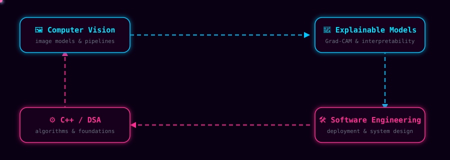

 

<table align="center">

</table>

 

 

## 🧬 Tech Stack

<table width="100%">
<tr>
<td width="33%" valign="top" align="center">

**Languages**
  

</td>
<td width="33%" valign="top" align="center">

**Deep Learning**
  

</td>
<td width="33%" valign="top" align="center">

**Tools & Deployment**
  

</td>
</tr>
</table>

`Streamlit`&nbsp;·&nbsp;`SQL`&nbsp;·&nbsp;`Oracle Cloud Infrastructure`

## 🧠 What I Build

 

## 📦 Featured Projects

 

<table width="100%">
<tr>
<td width="50%" valign="top">

### 🌿 CropGuard
Multi-crop disease detection

- 38 classes across 5+ species (Apple, Corn, Grape, Tomato, Potato)
- Served via Streamlit, inference under 3s
- Built with a 6-member team · Apr 2026

</td>
<td width="50%" valign="top">

### 🧠 BrainTumorNet
MRI tumor classification

- Transfer learning, Adam optimizer (lr=0.0001), 25 epochs
- Preprocessing via OpenCV
- Built with a 6-member team · Jul 2024

</td>
</tr>
</table>

## 🎓 Certifications

## 📊 GitHub Analytics

## 🐍 Contribution Snake

## 📡 Connect

<i>Still training. Still shipping.</i>

